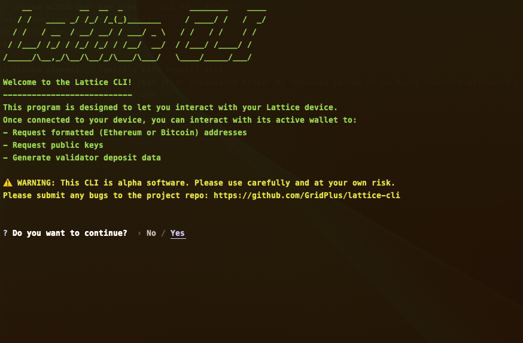

# GridPlus CLI

> ⚠️ WARNING: This CLI is alpha software and should be used with caution. If you discover any bugs, please report them in this repo. Pull requests are also welcome!

👋 Welcome to the GridPlus CLI. This software is intended to facilitate easy access to your [Lattice](https://gridplus.io/lattice) hardware wallet device for important functionality that may be best served for the command line.

## Contents

* [Logging Into a Lattice](#logging-into-a-lattice)
* [Commands](#commands)
  * [Export ETH2 Deposit Data](#export-eth2-deposit-data)
  * [Get Address](#get-address)
  * [Get Public Key](#get-public-key)

# Logging Into a Lattice

Before you can use the CLI, you will need to connect to the target Lattice. Note that this device must be connected to the internet and discoverable.

### Setting Initial Login Info

> You can skip the following prompts by setting up a `.env` file using the format provided in `.env.sample`. This section explains what each of the items is.

If you don't have config options saved, you will need to answer some prompts in order to connect for the first time:

* **Enter Device ID:** Needed to discover your Lattice. To find yours, go to `Device ID` on your Lattice's home screen.

* **Enter Password:** Used to create a new [`Client` instance](https://gridplus.github.io/gridplus-sdk/api/classes/client.Client). The main purpose of this "password" (really more of a hashing salt) is to generate deterministic data for in the `Client` instance.

* **Enter Connection URL:** The routing domain in which to search for your target Lattice. By default, your Lattice is discoverable on the GridPlus routing domain (https://signing.gridpl.us). If you haven't changed that, you should just press enter to use the default value when prompted by the CLI. However, you can always change your routing network using [Lattice Connect](https://github.com/GridPlus/lattice-connect-v2).

### Pairing with the Lattice

If the CLI is able to find your Lattice, the device will render a screen with a six digit pairing code, which is valid for 60 seconds. You will now be prompted to enter this pairing secret into the CLI. If you enter the correct secret, a pairing record will be created on the Lattice. As long as this record remains on the Lattice (the user can remove it at any time), you will be able to reconnect at any time without having to pair.

### Saving Login Info

At this point, you will be asked if you wish to save this login info for future use. If you do, you won't have to enter it later. If you wish to connect to a different Lattice at some later time, you may also choose to start up the CLI and *not* use the saved login data.

# Commands

There are a series of commands you can use to interact with your Lattice. 

> NOTE: This is a limited subset of [`gridplus-sdk`](https://gridplus.github.io/gridplus-sdk/) functionality. More functionality may be added to the CLI at a later date. Pull requests are also welcome!

## Export ETH2 Deposit Data

If your Lattice is on firmware 0.17.0 or greater, you have access to your BLS keys and signatures. You can now use your Lattice to generate data necessary to start one or more validators. For more background information on the data being generated, see [this GridPlus resource](https://gridplus.github.io/gridplus-sdk/tutorials/ethDeposits).

> **NOTE:** The Lattice can be used to export validator data, but **cannot** be used as a validator itself. For that, you will need to setup your own staking node, assuming you are doing solo staking. See [this resource](https://ethereum.org/en/staking/) for more information on how Ethereum staking works.

We will now walk through the steps of generating deposit data for one or more validators.

### Step 1: Selecting a Withdrawal Key

> NOTE: At the time of writing, ETH2 withdrawals are not yet possible. Once they are added in the future, a separate `Withdraw ETH2 Stake` option will likely be added to this CLI.

After you select the `Export ETH2 Deposit Data` option, you will first be asked to choose a "withdrawal key type". Here are the options:

1. **BLS Key (default)** - if you choose this option, a BLS withdrawal public key will be fetched and included in the deposit data for this validator. The withdrawal key is derived relative to the deposit/validator key according to [EIP2334](https://eips.ethereum.org/EIPS/eip-2334). Specifically, for every deposit/validator key at `m/12381/3600/i/0/0`, a withdrawal key will be derived at `m/12381/3600/i/0`.
2. **ETH1 Address** - if you choose this option, you will be asked for the ETH1 address and it will be the only key capable of withdrawaing funds from your validator(s). Unlike for the default BLS option, the same ETH1 address will be used for *all* validators.

### Step 2: Setting a Starting Index

> NOTE: You should probably start with the default `0` index if you are adding validators from a new wallet.

After selecting your withdrawal key type, you will be asked for a **starting** validator index. Per [EIP2334](https://eips.ethereum.org/EIPS/eip-2334), the BIP39 path in question is `m/12381/3600/i/0/0` for the validator/depositor key.

Choosing a starting index lets you resume the process of adding more validators from the same wallet at some later point. The process to add one or more validators is always to add the keystores to your consensus layer client and to send the deposit data to e.g. [Ethereum Launchpad](https://launchpad.ethereum.org). Therefore it does not matter how many validators have been added in the past - you can always add more using the same steps.

### Step 3: Build Deposit Data

> TODO: Add docs for choosing method of export and also discuss why ETH1 should be the default option

Now that your withdrawal credentials and starting validator index are set, the CLI will start generating data. For each validator index (starting with the first one):

1. Export the encrypted deposit private key. This will need to be imported into your consensus layer client prior to validator activation.
2. Request a signature from your Lattice to build deposit data. This is a BLS signature on a ["signing root"](https://github.com/ethereum/consensus-specs/blob/dev/specs/phase0/beacon-chain.md#compute_signing_root), which is needed to build a JSON-stringified deposit record. This record is needed to setup a new validator on the network using, for example, the [Ethereum Launchpad](https://launchpad.ethereum.org).
3. Ask if you'd like to repeat the process (steps 1 & 2) for the next sequential validator.

### Step 4: Exporting Deposit Data

Once you decline to generate data for the next validator, you are finalizing the process. The CLI will ask where you want to save the exported files. Once you choose the location, the CLI will output several files into the specified directory:

* `{outDir}/deposit-data-{timestamp}.json`
* For each validator index `i`: `{outDir}/validator-{i}-{pubkey}-{timestamp}.json`

## Get Public Key

If you would like to get a public key for a supported curve (see below table) you can request its hex-string representation using a BIP39 derivation path. As with other methods, the returned pubkey will be derived from the target Lattice's current active wallet.

| Curve | Key Length (bytes) | Key Format |
|:---|:---|:---|
| `secp256k1` | 65 | `04{X}{Y}` |
| `ed25519` | 32 | N/A |
| `bls12_381_g1` | 48 | `{X}` |

## Get Address

The Lattice is able to export a few types of *formatted* addresses, which depend on the BIP39 derivation path specified (specifically on the first two path indices, `purpose`, and `coin_type`, respectively):

| `purpose` | `coin_type` | Address Type | Address Format |
|:---|:---|:---|:---|
| `44'` | `60'`| Ethereum | `0x...` |
| `84'` | `0'` | Bitcoin bech32 | `bc1...` |
| `49'` | `0'` | Bitcoin wrapped segwit | `3...` |
| `44'` | `0'` | Bitcoin legacy | `1...` |
